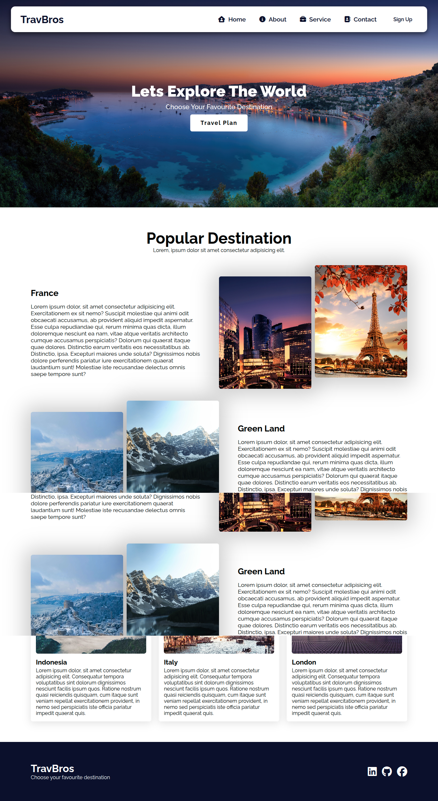

## ✈️ TravBros - Frontend Website

A modern **travel website frontend** built with **React** and powered by **Vite**.  
This project showcases a responsive, fast, and interactive UI for exploring travel destinations and services.  

## 🌐 Live Demo
🔗 [View TravBros](https://your-username.github.io/travbros-frontend/)  

## 👀 Preview

## 🛠️ Technologies Used
- React  
- Vite  
- JavaScript (ES6+)  
- HTML5 & CSS3  
- Font Awesome (icons)  

## ✨ Features
- ⚡ **Fast performance** with Vite build system  
- 🎨 Responsive UI for desktop and mobile  
- 📍 Travel & tourism themed design  
- 🧩 Component-based architecture (React)  
- 🌐 Static build ready for GitHub Pages deployment  

## ⚠️ Note: This repository contains only the **production build** of the website (`index.html`, `assets/`). The source code was not included.  
